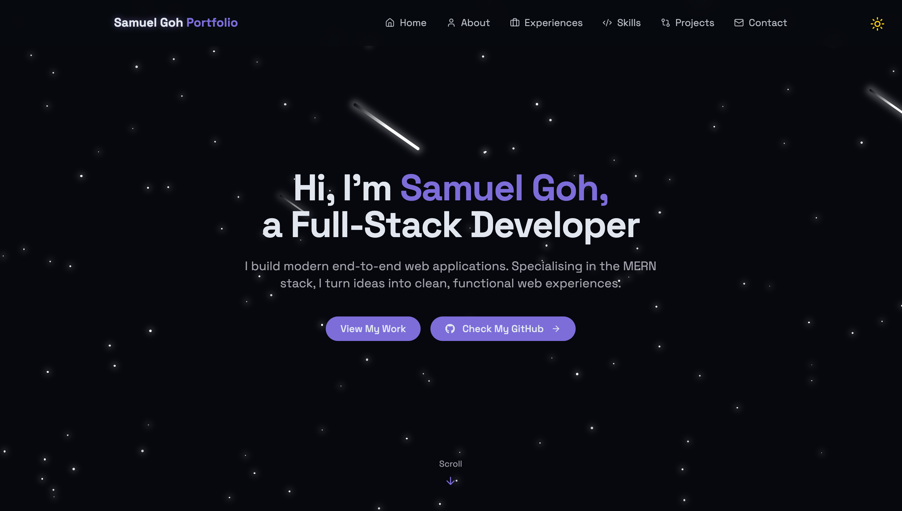

# Samuel Goh's Portfolio

This is my portfolio website made with ReactJS and Tailwind CSS. This is a single-page website that showcases my skills, projects and experiences in the field of web and mobile development. View the live site [here](https://samueljjgoh.com)



## Installation

To run this portfolio locally, follow these steps: 
1) Clone the repository (e.g. git clone https://github.com/SamuelJJGoh/portfolio-website.git)
```bash
git clone https://github.com/your-username/portfolio-website.git 
```
2) Navigate to the project directory
```
cd portfolio-website
```
3) Install dependencies
```bash
npm install
```
4) Get the Service ID, Template ID and Public Key from your EmailJS account and paste it in the .env file, like this :

```
VITE_SERVICE_ID = your_service_id
VITE_TEMPLATE_ID = your_template_id
VITE_PUBLIC_KEY = your_public_key
```
5) Start the development server
```bash
npm run dev
```
6) Open your browser and visit http://localhost:5173

## Features
- **Responsive Design:** The layout is fully responsive and optimised for desktops, tablets, and mobile devices using Tailwind CSS.
- **Project Showcase:** A curated list of my best projects with descriptions, tech stacks, and external links to source code or demos.
- **Experience and Skills Section:** Showcases my proficiency and background in different programming languages, libraries/frameworks and tools.
- **Contact Form:** Integrated with EmailJS to allow visitors to send messages directly through the website.
- **Light/Dark Mode:** Custom dark/light theme powered by CSS variables and Tailwind utilities.

## Technologies Used

### Frontend
- React
- Vite
- Tailwind CSS
- React Router
- Lucide Icons

### Utilities
- EmailJS (contact handling)
- Custom CSS variables for theme system
  
## Project structure
The project structure follows a standard React application layout. Some key directories include: 
- `public` — static assets including images used in Projects and Skills sections
- `src/components` — reusable React UI components
- `src/pages` — route level components (Home page and NotFound page)
- `index.css` - global Tailwind CSS styling used across the website
- `.env` - file to store the Service ID, Template ID and Public Key from EmailJS account when implementing the contact form 

## License
This project is licensed under the MIT License.

## Thank you!
- Thank you for exploring my portfolio! If you have any feedback or opportunities to discuss, feel free to reach out.
- **Email:** samueljjgoh@gmail.com
